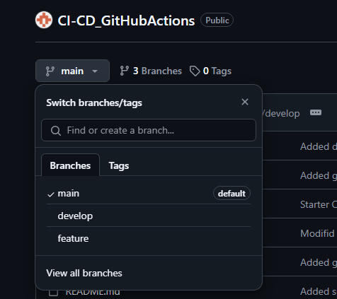

# CI-CD_GitHub Actions

## Description

This project is to demonstrate the use of GitHub Actions for a CI/CD pipeline to run component tests via Cypress when a pull request is made in the develop branch. The application is then deployed when the code is merged from the develop branch to the main branch. Working on this project helps to understand how to use GitHub actions, setup yml files and apply/understand CI-CD deployment concepts.

## Table of Contents

- [Description](#description)
- [Usage](#usage)
- [Credits](#credits)

## Usage

This link is a link to the deployed Render site: [Deployed Link](https://ci-cd-githubactions-oqrq.onrender.com)

Here is a image of all three branches: main, develop and feature.

When a change is made and pushed to the feature branch this is what it'll look like and it can be merged if the tests passes.

When the merge from feature branch to develop branch has been accepted and executed. A request from develop to main can be made and when it is verified and merged the render website will be deployed.

## Credits

Below is my GitHub profile. Any suggestions to improve functionality and code, feel free to reach out to me!

GitHub: https://github.com/AVue00

